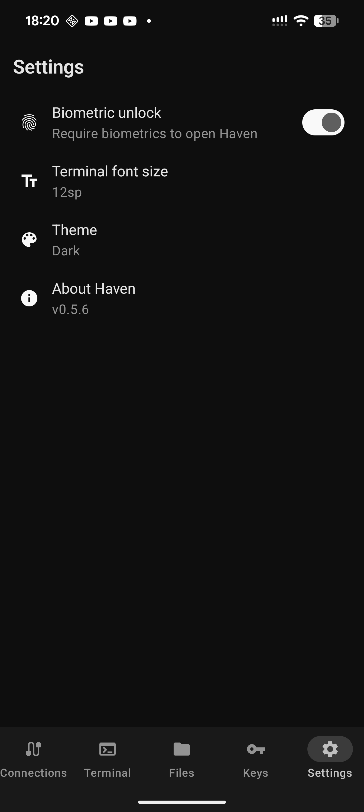

# Haven

Open source SSH and SFTP client for Android.

Connect to your servers with a full terminal emulator, browse and transfer files over SFTP, and manage your SSH keys — all from your phone.

## Features

- **SSH terminal** with multi-session tab support
- **SFTP file browser** for uploading and downloading files
- **SSH key management** — generate and store Ed25519, RSA, and ECDSA keys
- **Biometric app lock** — fingerprint or face authentication
- Configurable terminal font size
- Light, dark, and system-default themes
- Material You dynamic colors on Android 12+
- No ads, no tracking, no data collection

## Screenshots

<p float="left">
  
  
  
</p>

## Building

```bash
git clone https://github.com/GlassOnTin/Haven.git
cd Haven
./gradlew assembleDebug
```

The debug APK will be at `app/build/outputs/apk/debug/haven-*-debug.apk`.

## Privacy

Haven connects only to servers you configure. All data stays on your device. See [PRIVACY_POLICY.md](PRIVACY_POLICY.md) for details.

## License

[MIT](LICENSE)
